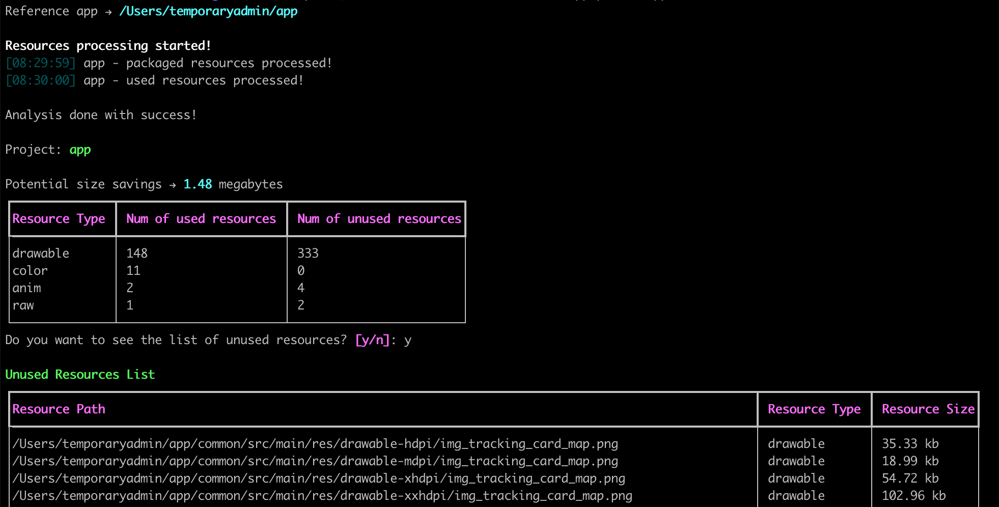

# Android Resources Checker

[](https://flake8.pycqa.org/en/latest/)
[](https://github.com/psf/black)
[](https://codecov.io/gh/fabiocarballo/android-resources-checker)
[](https://choosealicense.com/licenses/mit)

## What

This program will inspect the resources of your app and help you understand which ones are not being used and could
potentially be removed.

Main features:

- Identify the unused resources in your android project.
- Identify the unused resources in your android library (when you have a multi-repo setup)
- Listing of the unused resources (name, type and size)
- Deletion of the unused resources

## Installing

This program requires Python, supporting from 3.8.x and 3.9.x

In order to install run:

```shell
pip install -U android-resources-checker
```

## Using

## Inspecting your app resources.

Imagining your app in the project `subject-app`, you can trigger the resources inspection by running:

```shell
android-resources-checker --app /path/to/subject-app
```

## Inspecting your library app resources.

In the case you have two projects in separate repos, where a `client-app` depends on a `lib-app`, you can check the
unused resources of the library app by running:

```shell
android-resources-checker \
  --app /path/to/lib-app \
  --client /path/to/client-app-1 \
  --client /path/to/client-app-2
```

An example of a run could look like this:



## Reports

The default behavior is to generate reports on both the stdout and CSV.

You can specify a single type of report using the `--report=(CSV|STDOUT)` option.

If using CSV reports, you can specify the directory where to write the reports in the form of CSV files. For that use
the `--reports-dir` option.

For example:

```shell
android-resources-checker \
  --app /path/to/app \ 
  --reports-dir /path/to/reports
```

## Validation

There is also the option to run this as a validation tool. In this case, it will fail with an error if any unused
resources are found. 

To specify the validation use the `--check` flag (the default behavior is to perform no validation).

## License

```

Copyright (c) 2021 Dotanuki Labs, Fabio Carballo

Permission is hereby granted, free of charge, to any person obtaining a copy of this software and associated
documentation files (the "Software"), to deal in the Software without restriction, including without limitation the
rights to use, copy, modify, merge, publish, distribute, sublicense, and/or sell copies of the Software, and to permit
persons to whom the Software is furnished to do so, subject to the following conditions:

The above copyright notice and this permission notice shall be included in all copies or substantial portions of the
Software.

THE SOFTWARE IS PROVIDED "AS IS", WITHOUT WARRANTY OF ANY KIND, EXPRESS OR IMPLIED, INCLUDING BUT NOT LIMITED TO THE
WARRANTIES OF MERCHANTABILITY, FITNESS FOR A PARTICULAR PURPOSE AND NONINFRINGEMENT. IN NO EVENT SHALL THE AUTHORS OR
COPYRIGHT HOLDERS BE LIABLE FOR ANY CLAIM, DAMAGES OR OTHER LIABILITY, WHETHER IN AN ACTION OF CONTRACT, TORT OR
OTHERWISE, ARISING FROM, OUT OF OR IN CONNECTION WITH THE SOFTWARE OR THE USE OR OTHER DEALINGS IN THE SOFTWARE.

```


